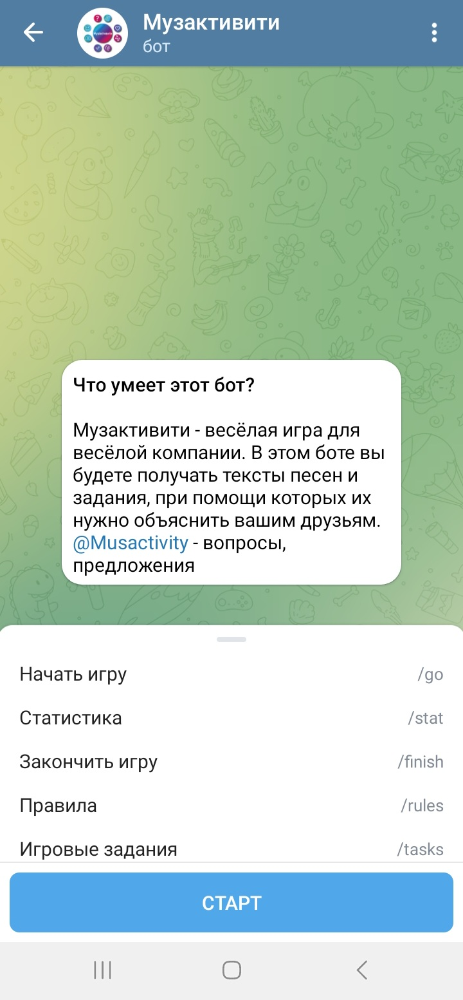
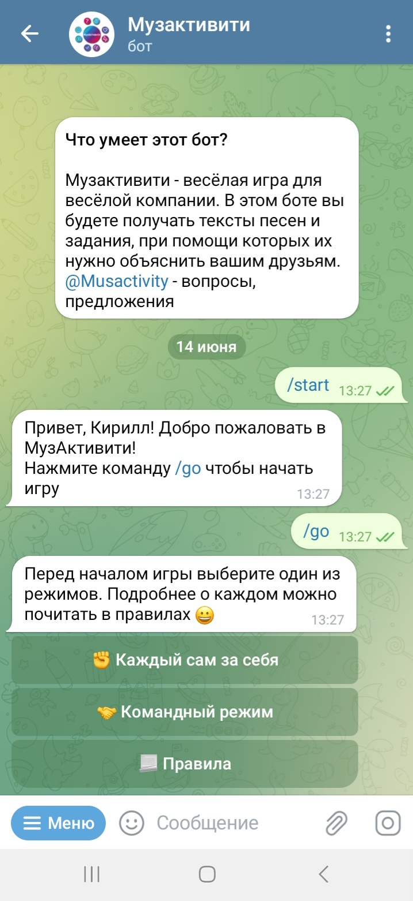
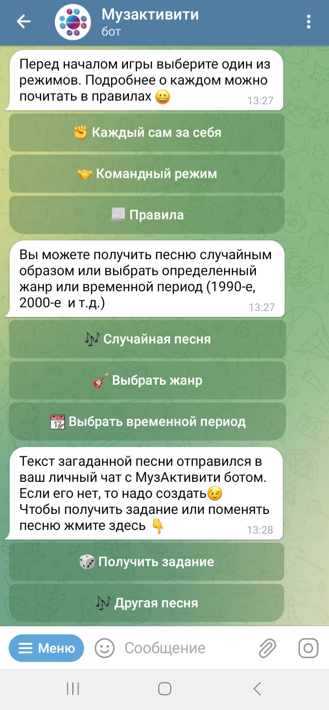
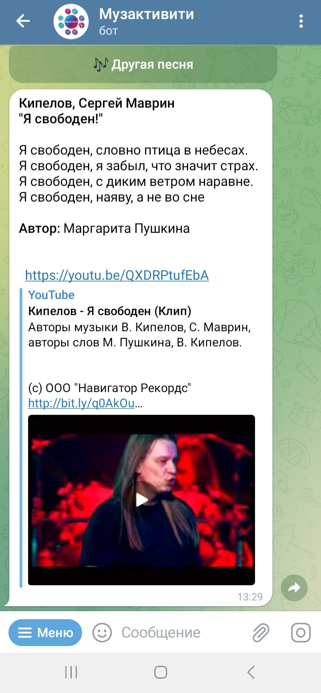
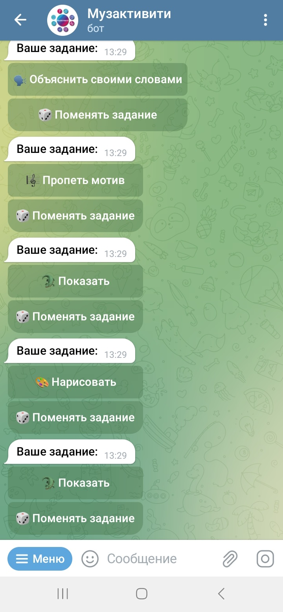
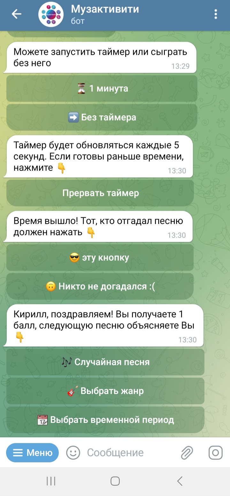
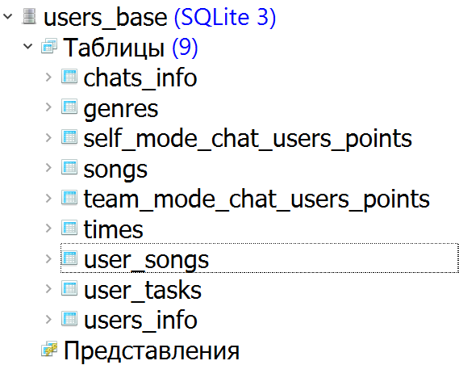

# MusActivity 
Настольная игра, реализованная в формате телеграм-бота

## Суть игры: 
Игроки при помощи телеграм-бота получают текст известной песни и задание, при помощи которого её надо объяснить остальным участникам игры.

### Как реализовано?

1. Создаём бота в .
2. Делаем базу данных в , разрабатываем её архитектуру под необходимые нам статистические данные.
3. Пишем на  код, создаем инлайн-клавиатуру, прописываем команды взаимодействия пользователей с ботом, формулируем SQL-запросы, вытягивающие данные из БД, а также пополняющие и меняющие её. 
4. Выкладываем на  для размещения на контейнерном хостинге - самом простом варианте автономной работы бота.

### Как это выглядит?
- Пользователь инициирует чат с ботом. Чтобы поиграть с друзьями, надо создать общий чат и добавить бота туда.
- Выбирается режим игры (каждый сам за себя или командный).

  
   
  

- Игроки по очереди получают песню в личные сообщения (помимо текста песни присылается ссылка на Youtube - можно сразу же послушать песню, если не знаешь её).
- После получения песни, игрок в общий чат получает задание, с помощью которого надо её объяснить. Задания (как и песни) можно менять.
- В боте реализована функция таймера, но его можно пропустить или прервать.
- После таймера тот, кто нажал угадал должен нажать кнопку и получить балл, который уходит в таблицу БД с очками пользователей.

  
   
  

### Как реализована база данных? 

 

 В базе 9 таблиц:  
1. Таблица с информацией по чатам  
2. Таблица "жанры" - в ней фиксируется выбор определенного жанра пользователями   
3. Таблица со статистикой очков в индивидуальном режиме    
4. Таблица с песнями - в ней указан автор, исполнитель, текст, жанр, временной период, ссылка на YouTube      
5. Таблица со статистикой очков в командном режиме      
6. Таблица "времена" - в ней фиксируется выбор определенного временного периода пользователями    
7. Таблица "песни пользователей" - в ней фиксируется путь пользователя - получение песни (её смена), определение задания, начисление баллов   
8. Таблица "задания пользователей" - в ней фиксируется то, какие задания получают пользователи, какие они меняют  
9. Таблица с информацией о пользователях

  
